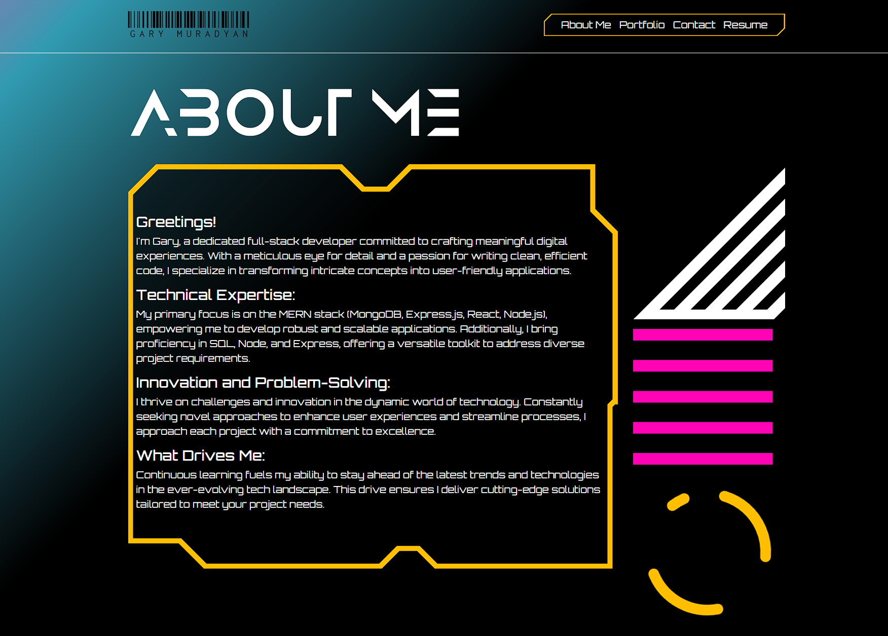

# # My Portfolio

This project is a personal portfolio website built using React for the frontend. The portfolio showcases my skills, projects, and provides a way for visitors to contact me.

## Description

The portfolio serves as a digital resume, highlighting my experience, skills, and projects. It includes sections such as About Me, Portfolio, Contact, and Resume.

## Technologies Used

  - React
  - React Router
  - React Bootstrap
  - CSS
  - React Bootstrap
  - GitHub API (for displaying projects)

  ## Usage

  Feel free to visit [my portfolio here]()

👋 Hi, I'm Gary, a student passionate about web development.

- 🔭 Currently exploring the world of web technologies.
- 🌱 Learning and building projects to enhance my skills.
- 💬 Let's connect! Feel free to reach out to me on [GitHub](https://github.com/garym636).